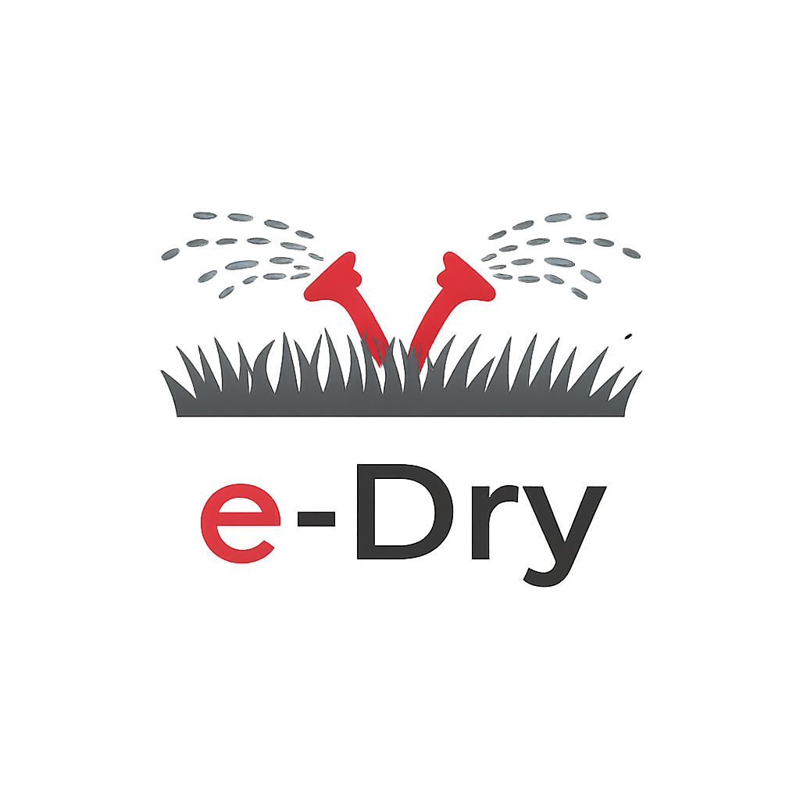

# e-Dry Irrigation custom component



Custom integration Home Assistant per il controllo irrigazione e-Dry.

Versione corrente: `10.0.10`.

Il component include `icon.png`, `logo.png`, `brand/` e `docs/assets/e-dry-irrigation.png` per mantenere il brand e-Dry nella UI Home Assistant/HACS.

Da `10.0.7` il form opzioni include etichette leggibili in italiano per le tarature meteo e SmartCalc.

## Installazione manuale

1. Copia la cartella `custom_components/e_dry` dentro la cartella `config/custom_components/` di Home Assistant.
2. Riavvia Home Assistant.
3. Aggiungi l'integrazione **e-dry Irrigation** dalla UI di Home Assistant.

La cartella deve essere:

```text
config/custom_components/e_dry/
```

Il dominio Home Assistant e' `e_dry`.

## Servizi principali

- `e_dry.start_zone`
- `e_dry.start_zone_for`
- `e_dry.stop_zone`
- `e_dry.update_zone`
- `e_dry.update_program`
- `e_dry.remove_stale_entities`
- `e_dry.request_event_log`
- `e_dry.clear_event_log`

## Integrazione con l'add-on dashboard

L'add-on dashboard e-Dry usa questa integrazione come backend funzionale. Il repository add-on e':

`https://github.com/edmondoalex/e-dry-irrigazione-addon`

La dashboard legge i sensori aggregati `sensor.e_dry_zones_info`, `sensor.e_dry_programs_info`, `sensor.e_dry_meteo_info` e invoca i servizi `e_dry.*`.

## Centralina meteo professionale

Da `10.0.4` il component usa e-SunMind come fonte meteo primaria tramite:

```text
http://192.168.3.24:1980/api/weather/irrigation
```

Il dato viene letto in background ogni 5 minuti e salvato in cache, cosi le decisioni della centralina non bloccano Home Assistant. Se l'endpoint non risponde, se il dato non e disponibile o se e troppo vecchio, e-Dry torna automaticamente alla logica legacy basata sui sensori Home Assistant configurati.

### Priorita meteo

La decisione segue questo ordine:

1. usa `/api/weather/irrigation` se `available=true` e `age_seconds` e sotto la soglia configurata;
2. blocca sempre con `freeze_block=true`;
3. blocca con `rain_block=true` o `is_raining=true`;
4. blocca con `wind_block=true`;
5. blocca se `rain_last_24h_mm` supera la soglia di pioggia recente;
6. blocca se `forecast_rain_24h_mm` supera la soglia di pioggia prevista;
7. se il dato e-SunMind non e valido, usa i vecchi sensori pioggia/temperatura/vento.

### SmartCalc 10.0.4

Con SmartCalc attivo, la durata finale di ogni zona e:

```text
durata_finale = durata_base * regolazione_manuale * smart_factor
```

`smart_factor` viene calcolato con:

- `et0_mm_day`: aumenta o riduce in base all'evapotraspirazione giornaliera;
- `rain_last_24h_mm`: riduce la durata dopo pioggia recente;
- `forecast_rain_24h_mm`: riduce o azzera la durata se e prevista pioggia;
- `temperature_c`: aumenta con caldo, riduce con fresco;
- `humidity_pct`: aumenta con aria secca, riduce con aria umida;
- `solar_radiation_w_m2`: aumenta leggermente con sole forte;
- `wind_speed_ms`: riduce leggermente se il vento e vicino alla soglia;
- `irrigation_weather_score`: modula la durata in base allo score meteo di e-SunMind.

Il fattore e limitato tra `0.0` e `2.5`, quindi la centralina non supera il 250% della durata base.

### Preset zona 10.0.9

Ogni zona puo avere un preset comportamento. Il preset non cambia la durata base della zona, ma applica un moltiplicatore al risultato SmartCalc:

```text
durata_finale = durata_base * regolazione_manuale * smart_factor_meteo * moltiplicatore_preset
```

Preset integrati:

- `standard`: 1.00, comportamento neutro;
- `erba`: 1.15, utile per prato;
- `fiori`: 1.05, utile per aiuole e fioriere;
- `piante`: 0.90, utile per siepi e piante stabilizzate;
- `orto`: 1.20, utile per orto e colture piu assetate;
- `vasi`: 1.30, utile per vasi esposti;
- `alberi`: 0.75, utile per alberi o irrigazioni meno frequenti.

I preset custom sono salvati nelle opzioni del config entry Home Assistant tramite il servizio `e_dry.update_zone_profiles`. Anche l'assegnazione del preset alla singola zona viene salvata in modo persistente dentro la lista `zones`, quindi resta dopo restart di Home Assistant e dell'add-on.

Il sensore `sensor.e_dry_zones_info` espone:

- `zone_profiles`: preset disponibili, integrati e custom;
- per ogni zona: `profile_id`, `profile_name`, `profile_smart_multiplier`, `smart_duration` ed `effective_duration`.

Esempio servizio per assegnare un preset:

```yaml
service: e_dry.update_zone
data:
  zone_id: 1
  profile_id: erba
```

Esempio servizio per salvare preset custom:

```yaml
service: e_dry.update_zone_profiles
data:
  profiles:
    - id: "agrumi"
      name: "Agrumi"
      smart_multiplier: 1.10
      wind_sensitive: false
```

### Opzioni consigliate

In **Impostazioni integrazione > e-dry Irrigation > Opzioni > Impostazioni Generali**:

```text
esunmind_weather_api_url: http://192.168.3.24:1980/api/weather/irrigation
weather_max_age_seconds: 900
forecast_rain_skip_mm: 6
recent_rain_skip_mm: 4
enable_smart_calc: true
wind_threshold: 20
min_temp: 5
rain_threshold: 0
```

Valori pratici:

- `weather_max_age_seconds`: 900 significa dato valido fino a 15 minuti;
- `forecast_rain_skip_mm`: 4-6 mm per giardino normale, 8-10 mm se vuoi irrigare comunque con piogge leggere previste;
- `recent_rain_skip_mm`: 3-5 mm per prato e aiuole, 6-8 mm per terreno molto drenante;
- `wind_threshold`: 15-20 km/h per popup/spruzzo, 25-35 km/h se usi goccia;
- `min_temp`: 3-5 °C per blocco gelo.

### Sensore diagnostico

Il sensore `sensor.e_dry_meteo_info` espone gli attributi principali:

- `weather_mode`: `e_sunmind_irrigation_api` oppure `legacy_ha_sensors`;
- `status`: `OK` o `BLOCCATO`;
- `reason`: motivo della decisione;
- `smart_factor` e `smart_reason`;
- `source`, `age_seconds`, `available`;
- `rain_block`, `wind_block`, `freeze_block`;
- `rain_last_24h_mm`, `forecast_rain_24h_mm`, `et0_mm_day`;
- `irrigation_weather_score` e `irrigation_weather_reason`.

### Zone che ignorano il meteo

Da `10.0.10`, se una zona ha `ignore_weather=true`:

- non viene saltata per blocchi meteo;
- non applica il fattore SmartCalc meteo;
- applica comunque il moltiplicatore del preset zona;
- applica comunque la regolazione manuale globale.

Questa opzione e utile per serre, vasi coperti, goccia sotto tettoia o linee tecniche che devono partire indipendentemente dal meteo.
